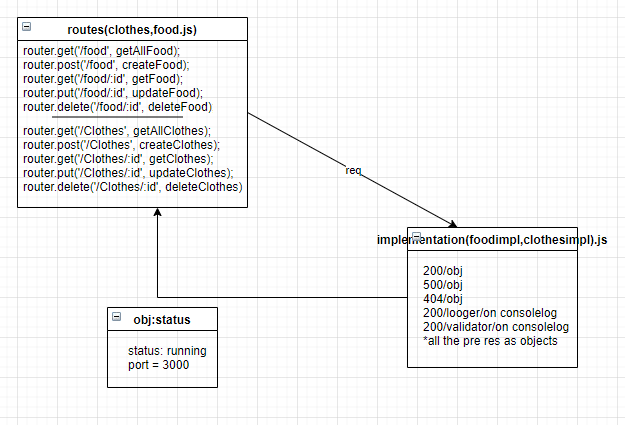

# basic-api-server
LAB - 03 Express REST API

* Author: Maram Abu Murad
* [tests report]()
* [Heroku link]()
* Setup .env requirements PORT - 3000
* Running the app npm index.js
* Endpoint: 
/food
/food/:id
----
/clothes
/clothes/:id
* Endpoint : '*' returns ERROR 'Page NOT FOUND.'
* Endpoint : /badConnection Returns Object { "error": 500, "path": "/badConnection", "message": "Something WENT WRONG Internal Server Error" }
* Tests 
npm test
 * 